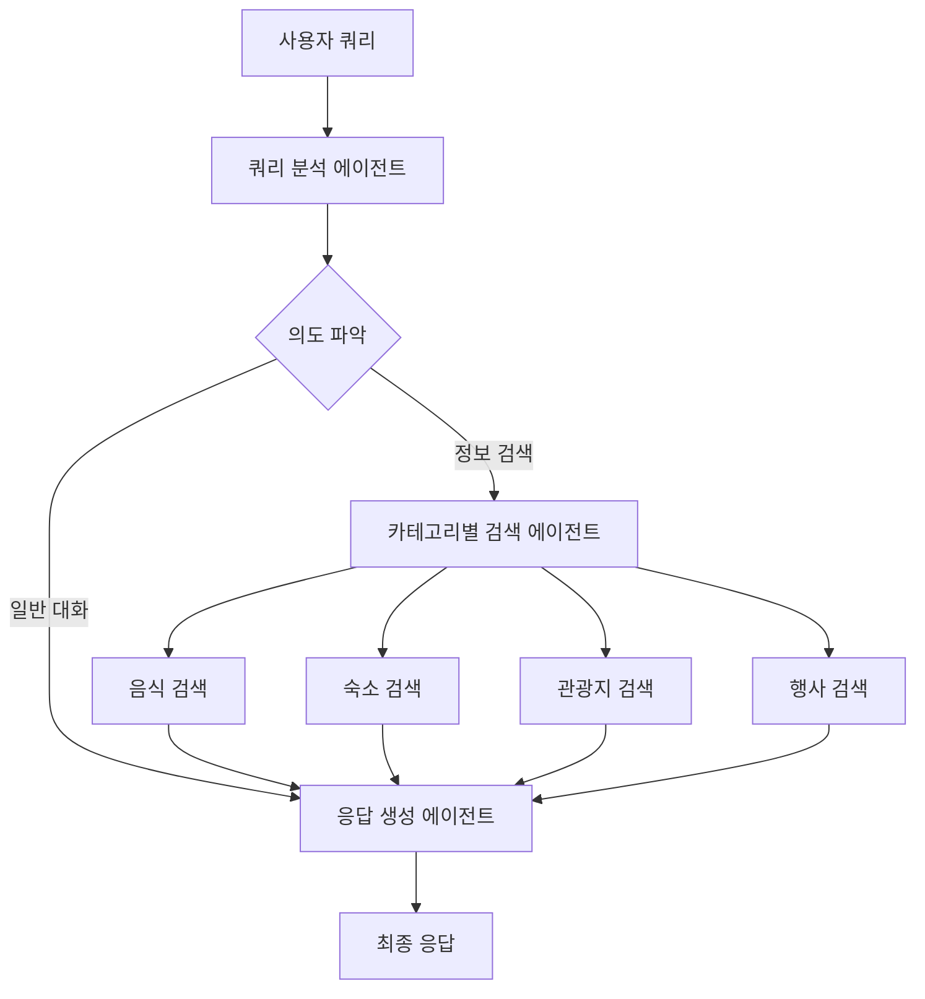

# 오르다 - 제주도 여행 추천 챗봇 🗾

**사용자 맞춤형 제주도 여행 일정 추천 챗봇**

LangGraph 기반 Multi-agent RAG 시스템으로 구현된 제주도 여행 전문 AI 어시스턴트입니다.

## ✨ 주요 기능

- **🤖 Multi-agent 시스템**: 쿼리 분석, 카테고리별 검색, 응답 생성 에이전트
- **🔍 스마트 검색**: 음식, 숙소, 관광지, 행사 카테고리별 전문 검색
- **💬 멀티턴 대화**: 이전 대화 내용을 기억하는 지속적 대화
- **🗺️ 지도 연동**: 카카오 지도 API를 통한 위치 표시 및 경로 안내
- **💾 대화 기록**: 채팅 세션 저장 및 복원 기능
- **📊 여행 분석**: 장소간 거리/시간 계산 및 최적 경로 제안

## 🛠️ 기술 스택

- **Backend**: LangGraph, LangChain, ChromaDB
- **LLM**: Ollama (gemma2:4b)
- **Embedding**: Upstage Solar Embedding
- **Frontend**: Streamlit
- **Maps**: Kakao Maps API, Folium
- **Vector DB**: ChromaDB

## 📁 프로젝트 구조

```
챗봇 오르다/
├── src/                    # 메인 소스 코드
│   ├── config/            # 환경 설정 관리
│   ├── database/          # ChromaDB 연동
│   ├── agents/            # Multi-agent 시스템
│   ├── maps/              # 카카오 지도 연동
│   ├── chat/              # 대화 기록 관리
│   └── ui/                # Streamlit UI
├── scripts/               # 유틸리티 스크립트
├── requirements.txt       # Python 의존성
└── main.py               # 애플리케이션 진입점
```

## 🚀 설치 및 실행

### 1. 환경 설정

```bash
# 가상 환경 생성 (권장)
python -m venv venv
source venv/bin/activate  # Windows: venv\Scripts\activate

# 의존성 설치
pip install -r requirements.txt
```

### 2. 환경 변수 설정

`.env` 파일을 프로젝트 루트에 생성:

```env
# 필수 설정
UPSTAGE_API_KEY=your_upstage_api_key_here

# 선택 설정  
KAKAO_API_KEY=your_kakao_rest_api_key_here
KAKAO_JS_KEY=your_kakao_javascript_key_here

# Amadeus 항공권 API (선택)
AMADEUS_CLIENT_ID=your_amadeus_client_id_here
AMADEUS_CLIENT_SECRET=your_amadeus_client_secret_here
# Test API (기본값) - 샘플 데이터 제공
AMADEUS_BASE_URL=https://test.api.amadeus.com
# Production API - 실시간 데이터 (유료)
# AMADEUS_BASE_URL=https://api.amadeus.com

OLLAMA_BASE_URL=http://localhost:11434
OLLAMA_MODEL=gemma2:4b
CHROMADB_PATH=./chroma_db
COLLECTION_NAME=visitjeju
MAX_RESULTS=5
CHAT_HISTORY_PATH=./chat_history
```

### 3. Ollama 설치 및 모델 다운로드

```bash
# Ollama 설치 (https://ollama.ai)
# macOS/Linux
curl -fsSL https://ollama.ai/install.sh | sh

# 모델 다운로드
ollama pull gemma2:4b
```

### 4. 데이터 준비 (선택사항)

제주도 관련 JSON 데이터를 `./data/` 디렉토리에 준비:
- `visitjeju_food.json` (음식점 데이터)
- `visitjeju_hotel.json` (숙소 데이터)  
- `visitjeju_tour.json` (관광지 데이터)
- `visitjeju_event.json` (행사 데이터)

```bash
# 데이터 로딩
python scripts/load_data.py ./data
```

### 5. 애플리케이션 실행

```bash
streamlit run main.py
```

브라우저에서 `http://localhost:8501` 접속

## 🎯 사용법

### 기본 채팅
- "제주도 맛집 추천해줘"
- "커플 여행으로 좋은 숙소 알려줘"
- "아이와 함께 갈 만한 관광지는?"

### 지도 기능
1. 채팅에서 장소 추천 받기
2. '지도' 탭에서 추천 장소 확인
3. 장소간 거리/시간 정보 확인

### 대화 관리
- 사이드바에서 이전 대화 목록 확인
- 새 대화 시작 또는 기존 대화 이어가기
- 대화 검색 및 삭제 가능

## 🔧 고급 설정

### ChromaDB 설정
```python
# src/config/settings.py에서 설정 수정
CHROMADB_PATH = "./custom_chroma_db"
COLLECTION_NAME = "custom_collection"
```

### LLM 모델 변경
```bash
# 다른 Ollama 모델 사용
ollama pull llama2:13b
```

`.env` 파일에서:
```env
OLLAMA_MODEL=llama2:13b
```

## 📊 Multi-agent 아키텍처



## 🗺️ 지도 연동

### 카카오 API 키 발급
1. [Kakao Developers](https://developers.kakao.com/) 가입
2. 애플리케이션 등록
3. **REST API 키**와 **JavaScript 키** 복사하여 `.env`에 설정
   - `KAKAO_API_KEY`: REST API 키 (장소 검색, 길찾기용)
   - `KAKAO_JS_KEY`: JavaScript 키 (지도 표시용)

### 지원하는 지도 기능
- 주소 기반 좌표 변환
- 키워드 장소 검색
- 경로 안내 및 소요 시간 계산
- 여행지간 거리/시간 매트릭스

## 🛠️ 개발 가이드

### 새로운 에이전트 추가
```python
# src/agents/custom_agent.py
from .base_agent import BaseAgent

class CustomAgent(BaseAgent):
    def process(self, query: str, context: dict = None):
        # 커스텀 로직 구현
        pass
```

### 새로운 데이터 소스 추가
```python
# src/database/chromadb_client.py
def load_custom_data(self, file_path: str):
    # 커스텀 데이터 로딩 로직
    pass
```

## 🔍 문제 해결

### 자주 발생하는 오류

1. **Ollama 연결 실패**
   ```bash
   # Ollama 서비스 상태 확인
   ollama list
   
   # 서비스 재시작
   ollama serve
   ```

2. **ChromaDB 초기화 오류**
   ```bash
   # 기존 데이터베이스 삭제 후 재생성
   rm -rf ./chroma_db
   python scripts/load_data.py
   ```

3. **API 키 오류**
   - `.env` 파일 존재 확인
   - API 키 유효성 확인
   - 권한 설정 확인

## 🤝 기여하기

1. Fork the repository
2. Create feature branch (`git checkout -b feature/amazing-feature`)
3. Commit changes (`git commit -m 'Add amazing feature'`)
4. Push to branch (`git push origin feature/amazing-feature`)
5. Open Pull Request

## 📝 라이선스

이 프로젝트는 MIT 라이선스 하에 있습니다.

## 📞 지원

- 이슈 리포트: GitHub Issues
- 기능 요청: GitHub Discussions
- 이메일: [지원 이메일]

---

**🌟 제주도 여행을 더 특별하게! 오르다와 함께하세요!**
